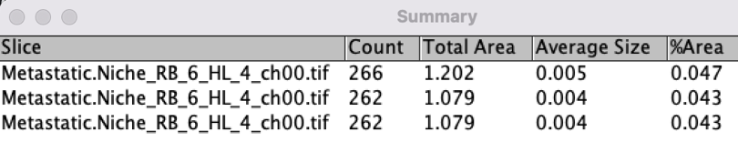

# How to Analyze Images

## Cell Counts ## 

1. Download all images from the computer. All channels must be downloaded individually. 

2.	Open the folder containing images. Organize the images by their respective channels. You should have a new folder for each individual channel.

    - 	If you imaged 10 tumors, `ch00/` folder should contain ten different images of tumors, all of the channel 00.

        


3. Open the Image app
    
    - Navigate to the "__Process__" tab, then select "__Batch__ -> __Macro...__"

        

    - In the new window, select "__Input__"

    - Navigate to the folder you created for your DAPI channel and select it.  

    - Create a new folder called `DAPI_output` on your Desktop.

    - On ImageJ, select "__Output__" and choose the new `DAPI_output` folder you just created.
    
    - In the large white text box, copy and paste this code:
        ```
        run("16-bit");
        setAutoThreshold("Default dark no-reset");
        //run("Threshold...");
        setOption("BlackBackground", false);
        run("Convert to Mask");
        run("Watershed");
        ```
    
        It should look like this:

        


    - Click "__Process__" in the bottom right and your output folder `DAPI_output` should become populated with new images.

    - Now we will repeat the process for non-DAPI instead of DAPI. __Repeat this entire #3 block _up until this bullet point___; we will not run the above code again.

    -----
    
    - Once you are ready to input code for the non-DAPI channels, this is the new code to input:
        ```
        run("16-bit");
        setAutoThreshold("Default dark no-reset");
        //run("Threshold...");
        setOption("BlackBackground", false);
        run("Convert to Mask"); 
        ```

        Note that the only difference between this code and the code for the DAPI channel is that we are deleting `run("Watershed");`.

        It should look like this:

        


4. You will now have multiple new output folders that are populated with the new images you just created.

5. 	Now, one by one (once comfortable, you can do three at a time), drag the new images into ImageJ. Navigate to the top, and click __“Analyze -> Analyze Particles”__ 

    - Make sure that “Display Results” and “Summarize” are the only boxes checked.

    - Circularity values describe how circular of a cell you want to count. 1 represents a perfect circle and 0 represents an elongated polygon.

    - For example, with nucleic DAPI stains, I set my circularity value to _0.30-1.00_. TDT/GFP stains I expand to _0-1.00_. Adjust as necessary for your cell type. 


6.	Now click __“OK”__ and a new pop up window should appear with your cell counts. 

    

<p>&nbsp;</p>

-----

## Blood Vessel Distance Analysis ##

1. On your __tdt/gfp__ images, you will first want to determine the blood vessels.

    - Open your newly created __tdtgfp__ channels and drag them into ImageJ.
    - In the ImageJ toolbar select the multipoint option.

        

    - Using this tool, mark all of your blood vessels.
    
    - In the top toolbar, click “__File -> Save As -> XY Coordinates__”.
        - Save file to your Desktop. The saved file should have all of the XY coordinates for your blood vessels. 

<h6>&nbsp;</h6>

2. Now we want to determine the XY coordinates of the CD31 cells. 

    - To do this, go to your created images for the CD31. It should be a folder titled `Ch0X_output`. Select the CD31 images that correspond to the blood vessels you just selected.

    - Drag this image into ImageJ.

    - Navigate to the top toolbar and select "__Analyze -> Analyze Particles__"
        - Make sure that “Display Results” and “Summarize” are clicked.

        - Two windows should appear when you click “__ok__”.

    - The __Results__ window will now list every single cell along with its X and Y coordinates.

3. You now have the XY coordinates of blood vessels, and individual cells. 

4. Enter them into an Excel file like this:

    

    - Make sure to delete the last 4 rows of the cell column if you copy and pasted values from ImageJ.


5. Store this Excel file in a folder on your Desktop. This folder should also contain the `.py` file of the proper python code.

6.	Open PyCharm CE.

7.	Drag this folder into PyCharm under the word “Project”

    

8. Open `cell_dists.py` in Python.

9.	Open the Terminal and run the following command: 
    ```
    python3 cell_dists.py $FILENAME
    ```
    Note that `$FILENAME` is a placeholder. Replace it with the name of Excel file you wish to run the program on. For example: 
    ```
    python3 cell_dists.py example.csv
    ```
    If there are spaces in the filename (not recommended), you will need quotes around it. 
    ```
    python3 cell_dists.py "excel file with spaces.csv"
    ```

10.	Click enter and a new document titled `$FILENAME_output.csv` will appear in the right toolbar. If executed correctly, the program will print a message in the console. 

    ```
    SUCCESS: Saved results to ../../$FILENAME_output.csv
    ```
    - This output folder will have every individual cell, with the cell it is closest to and the distance from that closest cell.
    - It can be opened in Microsoft Word for further analysis.

